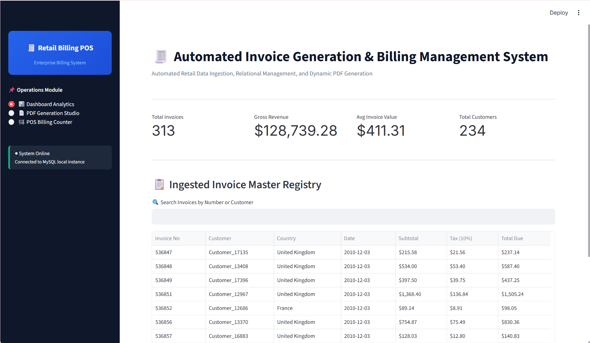
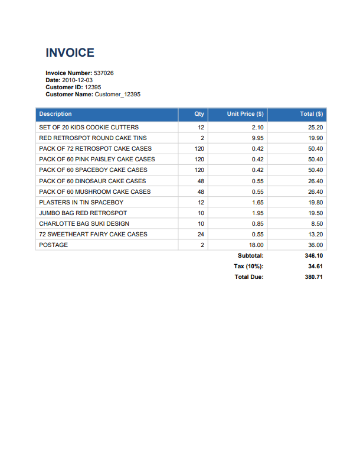

<div align="center">

# 🧾 Automated Invoice Generation & Billing Management System

[](https://www.python.org/)
[](https://streamlit.io/)
[](https://www.mysql.com/)
[](https://www.reportlab.com/)

**An end-to-end Capstone Billing & Revenue Analytics Solution**  
*Processes e-commerce datasets, automates PDF invoice rendering, and delivers live business intelligence.*

---

</div>

## 🌟 Key Highlights

- **📊 Dynamic Analytics Dashboard:** Built with Streamlit for real-time tracking of total revenue, invoice counts, and transaction averages.
- **⚡ Automated PDF Engine:** Uses ReportLab to generate dynamic, pixel-perfect invoice receipts automatically.
- **🗄️ Relational Database Core:** Backed by MySQL for reliable storage of clients, items, transactional ledgers, and billing statuses.
- **📈 Real-World Dataset Pipeline:** Automatically ingests and cleans the bulk `OnlineRetail` dataset for immediate analytical reporting.
## 🖼️ Application Preview

<div align="center">
  
  <br/><br/>
  
</div>
---

## 🏗️ System Architecture

```text
       ┌────────────────────────┐
       │   OnlineRetail.csv     │ (E-Commerce Ingestion)
       └───────────┬────────────┘
                   │
                   ▼
       ┌────────────────────────┐
       │   dataset_loader.py    │ (ETL & Cleaning)
       └───────────┬────────────┘
                   │
                   ▼
┌──────────────────────────────────────┐
│        MySQL Database (db_setup)     │
│  - clients   - invoices   - items    │
└──────────────────┬───────────────────┘
                   │
         ┌─────────┴─────────┐
         ▼                   ▼
┌──────────────────┐  ┌──────────────────┐
│   app.py (UI)    │  │ invoice_generator│
│ Streamlit Visuals│  │  ReportLab PDFs  │
└──────────────────┘  └──────────────────┘